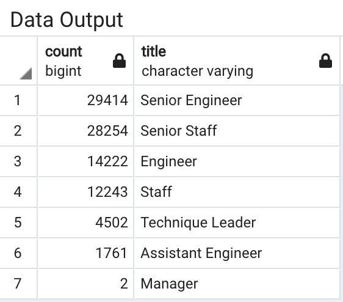
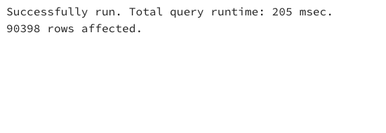

###Pewlett Hackard Analysis

###Overview
The purpose of this analysis was to explore the volume of retirees, role vacancies. This analysis will provide visilbilt into how many individuals will be retiring and how many job openings there will be in the future. SQL will be used to build employee databases from 6 different CSV files.

###Results
Per the data, Senior Engineer and Senior Staff have the highest volume of retirees. This means there will be a demand in these roles.

There will be over 90,000 employees retiring and the majority are coming from senior roles. This mean the company may want to get ahead in devolping potential talent to senior roles. 
There is only 2 retirees in the Manage role. This may be an error in the data since all the other roles are over 1000. If not, this may be a new position where the demographic is younger individuals.

###Summary

There is a strong need for PH to develop potential senior candiidaes and hire to feed the funnel. Not all employees will be willing to mentor thus taking the next steps is essential. 

Key insights mocing forward include:

- 90,398 employees retiring
- over 50% are in senior positions  
- eligible employes in mentorship program are 1,549

